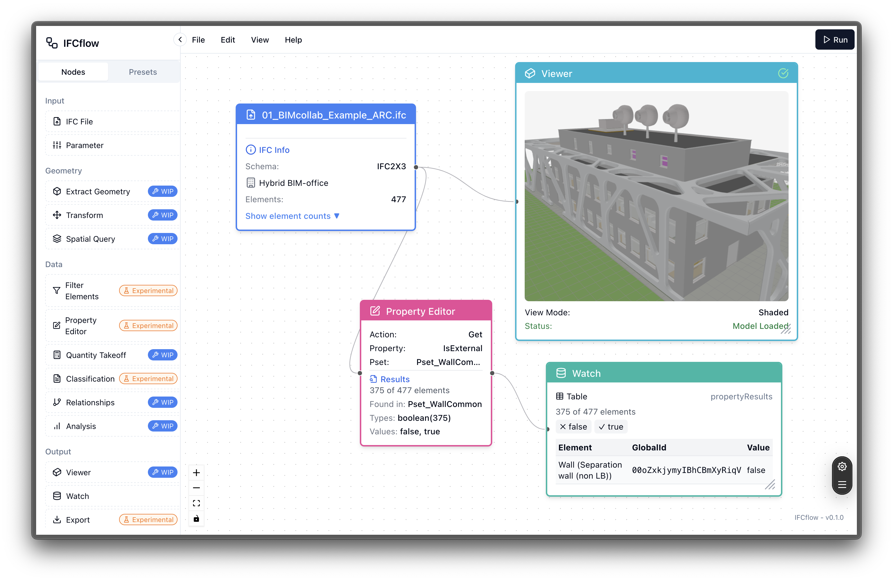
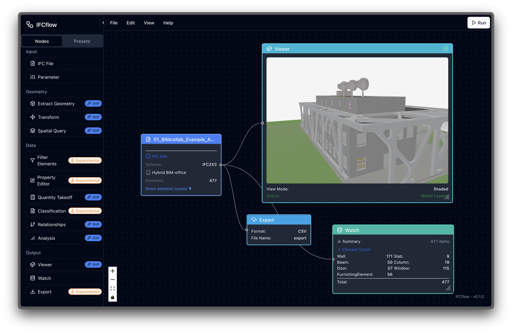

<div align="center">

# 🏗️ IFCflow

[](https://www.gnu.org/licenses/agpl-3.0)
[](https://nextjs.org/)
[](https://reactjs.org/)
[](https://tailwindcss.com/)
[](https://reactflow.dev/)
[](https://ifcopenshell.org/)

<p>A visual node-based tool for working with Industry Foundation Classes (IFC) files</p>

</div>

<table>
<tr>
<td width="50%">

</td>
<td width="50%">

</td>
</tr>
</table>

---

## 📋 Overview

IFC Flow Map provides a graphical interface for viewing, filtering, transforming, and analyzing Building Information Modeling (BIM) data through an intuitive workflow system. Create complex data manipulation pipelines with a simple drag-and-drop interface.

## ✨ Features

- 🔄 **Visual Node-Based Interface** - Create workflows by connecting nodes in a flow diagram
- 🏢 **IFC File Support** - Load and analyze IFC files for BIM data
- 🧩 **Multiple Node Types**:
  - 📁 **IFC Node** - Import IFC files
  - 📐 **Geometry Node** - Extract geometric information
  - 🔍 **Filter Node** - Filter elements based on properties
  - 🔄 **Transform Node** - Apply transformations to elements
  - 👁️ **Viewer Node** - Visualize 3D models
  - 📏 **Quantity Node** - Extract quantity information
  - 🏷️ **Property Node** - Work with element properties and property sets
  - 🔖 **Classification Node** - Manage element classifications
  - 📍 **Spatial Node** - Perform spatial queries
  - 💾 **Export Node** - Export data in various formats (CSV, JSON, IFC)
  - 🔗 **Relationship Node** - Query element relationships
  - 📊 **Analysis Node** - Perform analyses like clash detection
  - 👀 **Watch Node** - Monitor element values
  - ⚙️ **Parameter Node** - Define workflow parameters
- 💾 **Workflow Storage** - Save and load workflows
- ⚡ **Real-time Execution** - Execute workflows and see results immediately
- ⌨️ **Keyboard Shortcuts** - Efficient workflow creation with keyboard shortcuts
- 🔄 **Advanced Property Handling** - Get, set, add, and remove properties in IFC elements
- 📤 **IFC Export** - Export modified IFC files with your property changes
- 🧰 **IfcOpenShell Integration** - Leverage IfcOpenShell 0.8.1 for reliable IFC processing

## 🚀 Getting Started

First, run the development server:

```bash
npm run dev
# or
yarn dev
# or
pnpm dev
# or
bun dev
```

Open [http://localhost:3000](http://localhost:3000) with your browser to see the application.

## 📖 How to Use

1. **Create a New Workflow** - Start with a blank canvas
2. **Add Nodes** - Drag and drop nodes from the sidebar
3. **Connect Nodes** - Create connections between node inputs and outputs
4. **Load IFC Files** - Use an IFC node to import your BIM data
5. **Configure Node Properties** - Set properties in the properties panel
6. **Execute Workflow** - Run the workflow to see results
7. **Save Your Workflow** - Save workflows for later use

### 🛠️ Working with IFC Properties

1. **Get Properties** - Use the Property Node with "Get" action to extract properties like "IsExternal" from walls
2. **Set Properties** - Modify existing properties or add new ones with the "Set" action
3. **Connect Property Nodes** - Chain property operations by connecting nodes
4. **Export Modified IFC** - Use the Export Node with "ifc" format to save your changes

## 📚 Technical Details

- **Web-Based Processing** - All IFC processing happens client-side using WebAssembly
- **IfcOpenShell Integration** - Uses IfcOpenShell 0.8.1 via Pyodide for robust IFC handling
- **Property Management** - Comprehensive property handling across property sets (Psets) and quantities
- **JSON-Based IFC Model** - Efficient conversion between IFC and JSON for manipulation

## 📜 License

[](https://www.gnu.org/licenses/agpl-3.0)

This project is licensed under the GNU Affero General Public License v3.0 (AGPL-3.0). This means:

- You are free to use, modify, and distribute this software
- If you modify the software, you must distribute your modifications under the same license
- If you run a modified version of this software on a server that others can interact with, you must make the source code available to them

See the [GNU AGPL-3.0 License](https://www.gnu.org/licenses/agpl-3.0.en.html) for more details.

## 📚 Learn More

To learn more about the technologies used:

- [Next.js Documentation](https://nextjs.org/docs)
- [React Flow Documentation](https://reactflow.dev/docs/introduction/)
- [Radix UI Documentation](https://www.radix-ui.com/docs/primitives/overview/introduction)
- [IfcOpenShell Documentation](https://blenderbim.org/docs-python/)

## 🚀 Deployment

[](https://vercel.com/)

Check out the [Next.js deployment documentation](https://nextjs.org/docs/app/building-your-application/deploying) for more details.
